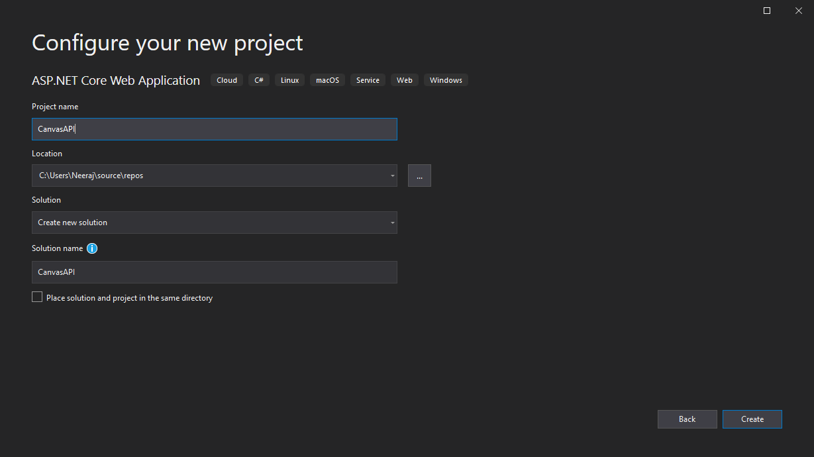
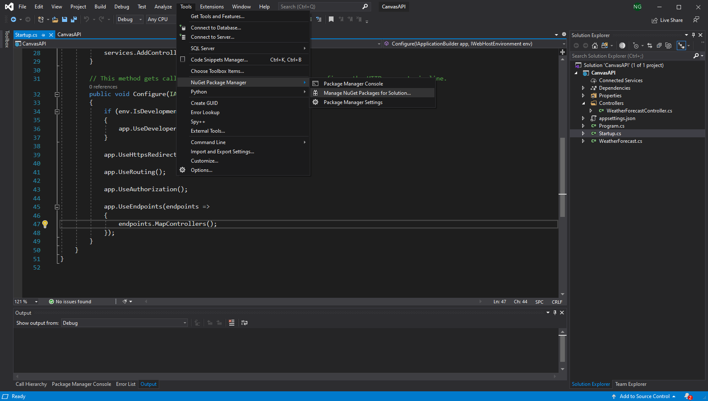
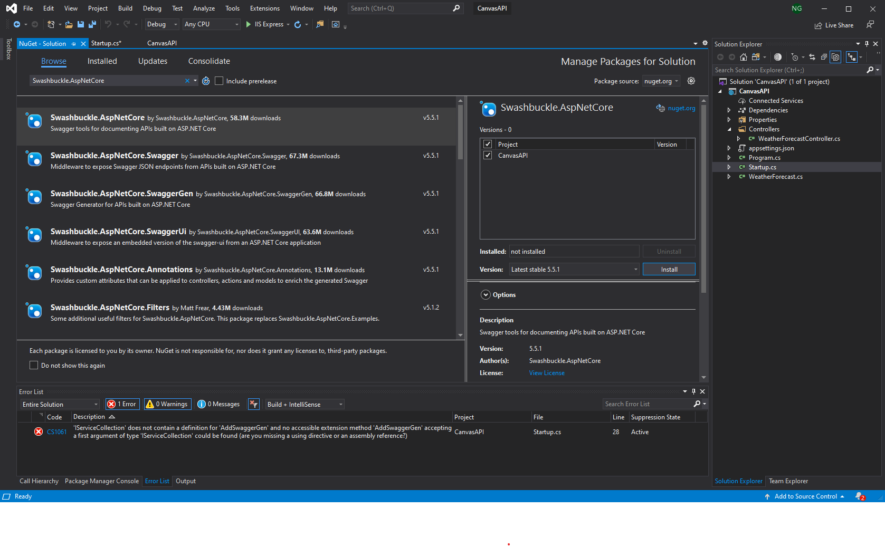
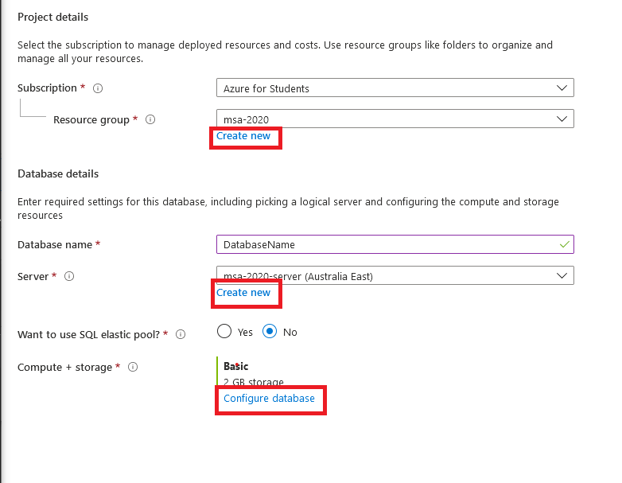
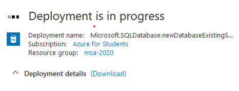
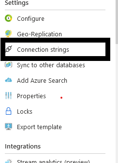
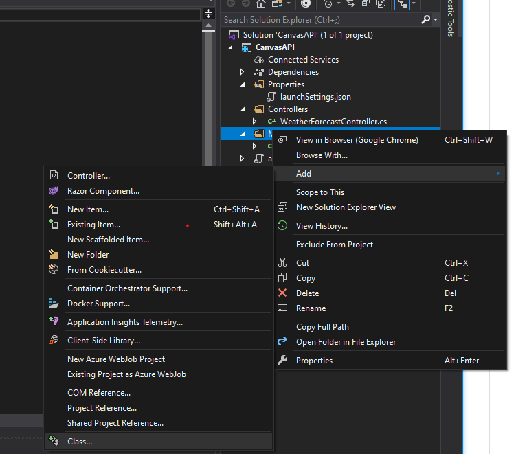
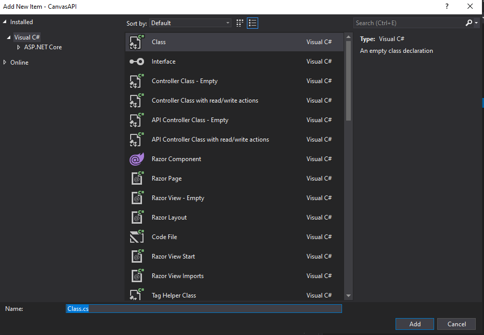
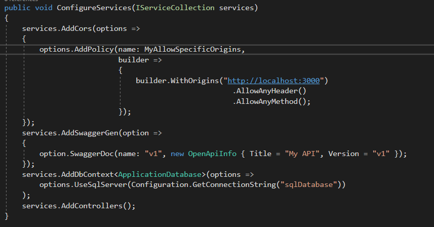

# Setup

If you didn't do Database and API module part in phase 1 please go and watch the video for that. This part will assume that you have watched the phase 1 Database and API video.

In this section, we will do the following:

- Create a ASP.NET Core project
- Add Swagger
- Set up Cors
- Create a Database
- Link Database to our project

## 1.1 Create a ASP.NET Core project

Open Visual Studio 2019 -> Create a new Project


Search for `ASP` <br>
Then select `ASP.NET Core Web Application` and press next


Enter the project in the `Project Name` field. <br>
Change the project folder location if required and then press next.



Select `API` then press next.


At this point your folder structure should look like the following.


## 1.2 Add Swagger

Open the Nuget package manager



Then search for `Swashbuckle.AspNetCore` and install it.


Add the following code to `ConfigureServices` in `Startup.cs` and fix the errors using the suggestions from the lightbulb in the VS editor.

```C#
services.AddSwaggerGen(option =>
{
    option.SwaggerDoc(name: "v1", new OpenApiInfo { Title = "My API", Version = "v1" });
});
```

If you hover over `OpenApiInfo` under which there is curently a red squiggly line, you'll see a lightbulb. Click on this lightbulb.
Then you will see a dropdown menu. Select the first item. <br>
This will import `Microsoft.OpenApi.Models`


Add the following to `Configure`

```C#
app.UseSwagger();
// Enable middleware to serve swagger-ui (HTML, JS, CSS, etc.),
// specifying the Swagger JSON endpoint.
app.UseSwaggerUI(c =>
{
    c.SwaggerEndpoint("/swagger/v1/swagger.json", "My first API V1");
});

```


Now, We have successfully added swagger to out project. <br>
If you run your project, it will by default open `https://localhost:44305/weatherforecast` in a webpage.<br>
Now, we'll change the default page that opens when we run our project. Open `Properties -> lanchSettings.json` and change `"launchUrl": "weatherforecast"` to `"launchUrl": "swagger/index.html"`.
Then, run the project. Now, by default it will open `https://localhost:44305/swagger/index.html` and it should look like this:


## 1.3 Set up Cors

Navigate to the Startup.cs file and add the following property:
`private readonly string MyAllowSpecificOrigins = "_myAllowSpecificOrigins";`

Now add the following in the `ConfigureServices` method.

```C#
services.AddCors(options =>
{
    options.AddPolicy(name: MyAllowSpecificOrigins,
        builder =>
        {
            builder.WithOrigins("http://localhost:3000",
                                "replaceThisByYourHostedUrl.com")
                                .AllowAnyHeader()
                                .AllowAnyMethod();
        });
});
```


Add the following to the `Configure` method before `app.UseAuthorization();`:<br>
`app.UseCors(MyAllowSpecificOrigins);`


Now, you'll no longer get the Cors issue.

## 1.4 Create a Database

Open a Web browser and navigate to `https://portal.azure.com`. Click on `SQL database` under Azure services.


Then click on `Add`.


Select your `Subscription`. If you are using the Student start pack then it should be either `Azure for Students` or `Azure for Students Starter`.
Create a `Resource group` if you don't have one already ( A resource group is made to store related thing under one group). <br>
Pick a `Database name`. <br>


Click on `Create new` under `Server`.

Then fill the following fields ( make sure you remember your password).


Make sure to pick the cheapest storage option by clicking `configure database`. Your `Compute + Storage` option should look like


Click `Review + create` and then click `Create` after checking all the information that you have entered. It will take a moment to create your database (be patient).



Click on `Go to resource`


Click on `Set server firewall`


Then create a Rule as the following:


Then click `Save` at the top left corner.

Now, you have successfully create a database.

## 1.5 Link Database to our Project

Click on the `Connection strings` option on the side bar to get the connection string of your database.



Then we'll copy our connection string.


Now, navigate back to VS and open `appsetting.json`. In this file add the follwing (remember to replace my connection string with yours :) ) -

```C#
"ConnectionStrings": {
    "sqlDatabase": "Server=tcp:msa-2020-tutorial.database.windows.net,1433;Initial Catalog=DatabaseName;Persist Security Info=False;User ID=pankaj;Password={your_password};MultipleActiveResultSets=False;Encrypt=True;TrustServerCertificate=False;Connection Timeout=30;"
  }
```

Change `{your_password}` to with your password. <br>
Note: You don't need `{}` if your password doesn't contain `{}`.
At this point it shoud look like this:

```C#
{
  "ConnectionStrings": {
    "sqlDatabase": "Server=tcp:msa-2020-tutorial.database.windows.net,1433;Initial Catalog=DatabaseName;Persist Security Info=False;User ID=pankaj;Password={your_password};MultipleActiveResultSets=False;Encrypt=True;TrustServerCertificate=False;Connection Timeout=30;"
  },
    "Logging": {
      "LogLevel": {
        "Default": "Information",
        "Microsoft": "Warning",
        "Microsoft.Hosting.Lifetime": "Information"
      }
    },
    "AllowedHosts": "*"
  }
```

Install the following NuGet packages:

- Microsoft.EntityFrameworkCore.SqlServer
- Microsoft.EntityFrameworkCore.Tools
- Microsoft.EntityFrameworkCore

These these packages in conjunction will let us connect to our SQL database, create tables in the database and write queries to retrieve and store data.

Create a folder called `Models` and then create a class '`ApplicationDatabase.cs` in the `Models` folder.


<br>



Now your folder structure should look like this:


Open `ApplicationDatabase.cs` and extend `ApplicationDatabase` class with `DbContext` and add the following constructor to it.
Use the lightbulb to resolve any import issues.
This will automatically inject the database context to our other classes ( known as Dependency Injection) .

The base keyword is used to call the constructor of the super class.

```C#
 public class ApplicationDatabase : DbContext
    {
        public ApplicationDatabase(DbContextOptions<ApplicationDatabase> options) : base(options)
        {
        }
    }
```

Use the lightbulb to resolve the import issues.<br>

Now, add the following to `ConfigureServices` method. This will connect our project to the Database.

```C#
services.AddDbContext<ApplicationDatabase>(options =>
    options.UseSqlServer(Configuration.GetConnectionString("sqlDatabase"))
);
```

Use the lightbulb to resolve the import issues.<br>
At this point, it should look like this:



Congratulation, you have successfully completed part 1.
