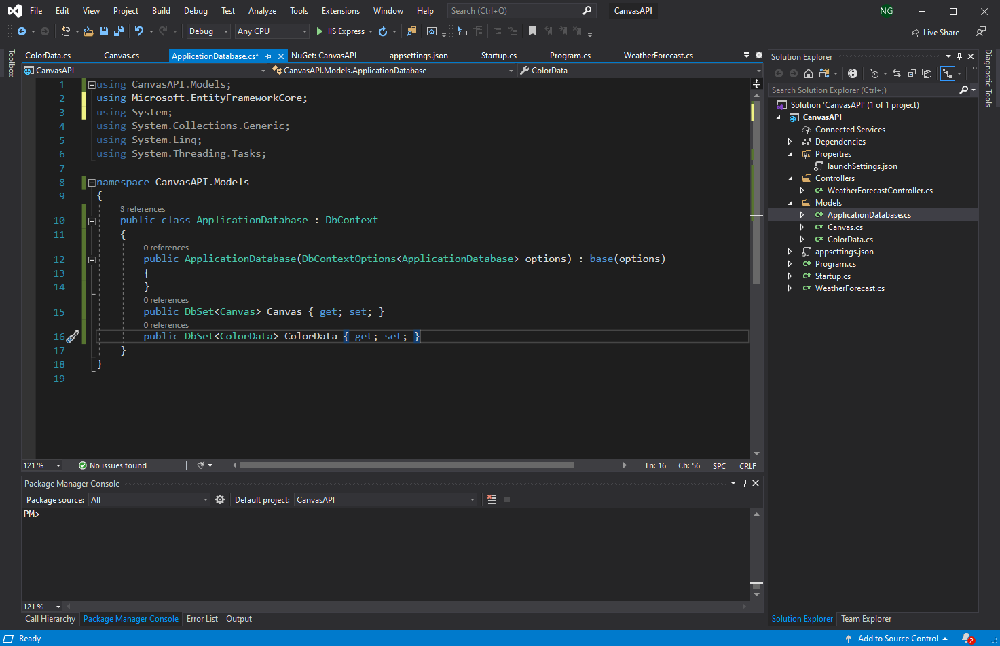
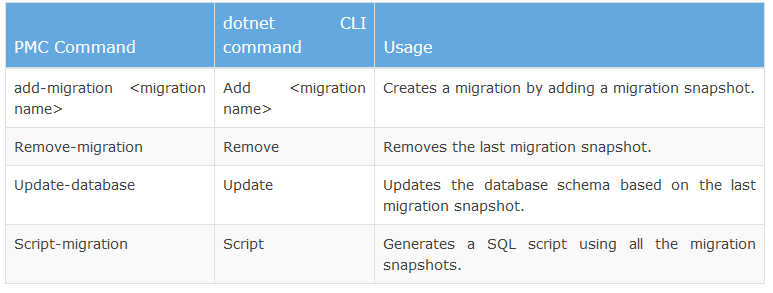

# Database

In this section we'll create tables in the database via our .NET CORE project.
We'll have a one to many relationship between `Canvas` table and `ColorData` table.
One entry in the `Canvas` table represents a entire canvas. Each canvas would have 32 x 32 related entries in the `ColorData` table to store the color value of each cell in the canvas.

Look at the databse schema below and make yourself familiar with it.


This is not the complete schema. We will extend it later on and add another table called `HistoricalData`. Which will store a complete history of each canvas. However, this should be sufficient to get all the basic features.

Now let's jump to Visual Studio.

## 2.1 Create tables

Create classes called `Canvas.cs` and `ColorData.cs` under the `Models` folder.


Add the following code to your `Canvas.cs` file:

```C#
public class Canvas
    {
        [Required]
        [DatabaseGenerated(DatabaseGeneratedOption.Identity)]
        [Key]
        public int CanvasID { get; set; }

        // foreign key to Color Data
        public ICollection<ColorData> ColorData { get; set; }
    }
```

We have one entry in the Canvas table, namely `CanvasID` ( which is the primary key). Each attribute also has a `get` and `set` method respectively, this allow us to read and update the respective values. The `ICollection<ColorData> ColorData` makes the one to many relationship between the `Canvas` table and `ColorData` table.

> `[Key]` denotes the primary Id that is used to identify the row of data. This annotation isn’t strictly needed if your variable has Id in the name, because by convention, a property named Id or <type name>Id will be configured as the primary key of an entity.

> `[DatabaseGenerated(DatabaseGeneratedOption.Identity)]` annotation tells the database that we want this attribute to be automatically generated when we add a Canvas to the database and it is the primary identifier. More information can be found [here](https://docs.microsoft.com/en-us/ef/core/modeling/entity-properties?tabs=data-annotations%2Cwithout-nrt).

> `[Required]` annotation tells the database that we don't want this entry to be left blank.


Use the lughtbulb icon to fix the import issues.
You will need to import the following:

- using System.ComponentModel.DataAnnotations;
- using System.ComponentModel.DataAnnotations.Schema;


Now, add the following to the `ColorData.cs` class:

```C#
 public class ColorData
    {
        [Required]
        [DatabaseGenerated(DatabaseGeneratedOption.Identity)]
        [Key]
        public int ColorDataID { get; set; }

        [Required]
        public int RowIndex { get; set; }
        [Required]
        public int ColumnIndex { get; set; }
        [Required]
        public string Hex { get; set; }

        // 1 canvas has many ColorData-s
        [Required]
        public int CanvasID { get; set; }
    }

```

Again, we are using `[Required], [Key] and [DatabaseGenerated(DatabaseGeneratedOption.Identity)]` annotation for the primary key of `ColorData`. We are also creating a field for `RowIndex` ( this will store the row index of a cell in a canvas), `ColumnIndex` ( this will store the column index of a cell in a canvas), `Hex` ( this will store the hex code, which is the color code) and `CanvasID` ( this is the foreign key field ).

Use the lightbuild icon to fix the import issues. We will need to import the same things as we did in `Canvas.cs`.


Now, all we need to do is add these classes to `ApplicationDatabase.cs` class.
For that, open `ApplicationDatabase.cs` and add the following:

```C#
public DbSet<Canvas> Canvas { get; set; }
public DbSet<ColorData> ColorData { get; set; }
```

At this point your `Application.cs` class should look like this:



## 2.2 Windows

If you are on a Mac skip to the Mac section. <br>
Open the `Package Manager Console`.


Then write `Add-Migration InitialMigration` in the `Package Manager Console`.


This will create a migration throught which we'll be able to add the tables to the SQL database.

You will notice the following Migrations folder in your solution.


Now, type `Updae-Database` in `Package Manager Console` to the update your SQL database.


Now, you have successfully updated the SQL databse.

## 2.3 Mac

If you're on a Mac open `Terminal` and navigate to your project folder.

Then write `ls`, make sure you see the following files in your project director: `phase-2-back-end/ phase-2-back-end.sln`.

Then write ` dotnet ef migrations add InitialMigration`. This will make a migrations folder in your project solution.

This will create a migration throught which we'll be able to add the tables to the SQL database. You will notice the following Migration folder in your soluton.


Now, type `dotnet ef database update` in `Termial` to the update your SQL database.

This table shows the difference between the commads of donet CLI and PMC (Package Manager Console).



Congratulation, you've have successfully created the basic database.
