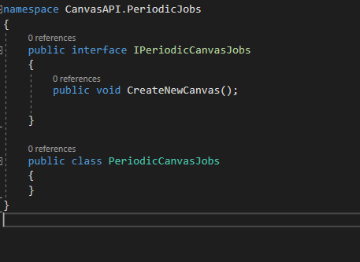

# Controllers

In the section we'll make the following Canvas controller with the following endpoints:

- GetCavas - which will return a 32 x 32 array of hex color codes
- UpdateCell - which will update the specified cell

First let's delete `WeatherForecastController.cs` ( which is inside the `Controllers` folder ) and `WeatherForecast.cs`.


## 3.1 Canvas Controller

First, we'll create a `CanvasController.cs` class as the following:


It should look like this:


Add the following to code to the `CanvasController.cs` file:

```C#
private ApplicationDatabase _context;
private int SIZE = 32;
public CanvasController(ApplicationDatabase context)
{
    _context = context;
}
```

ASP.NET core will inject a instance of `ApplicationDatabase` in the contructor though which we'll be able to access our SQL database.
`SIZE` property defines the the dimensions of each canvas.

Use the lightbulb icon to fix the import issues.

### 3.1.1 GetCanvas Endpoint

Now, we'll make our first endpoint. This will be a `Get` endpoint ( denoted by `[HttpGet]`). The route of this endpoint is denote by `[Route("GetCanvas")]`.

Add the following code to your `CanvasController.cs` file.

```C#
[HttpGet]
[Route("GetCanvas")]
public String GetCanvas()
{
    string[,] outputArray = new string[32, 32];
    var canvas = _context.Canvas
        .Include(c => c.ColorData)
        .OrderByDescending(c => c.CanvasID)
        .FirstOrDefault();

    var colorData = canvas.ColorData
        .OrderBy(c => c.RowIndex)
        .ThenBy(c => c.ColumnIndex)
        .ToArray();

    for (int i = 0; i < SIZE; i++)
    {
        for (int j = 0; j < SIZE; j++)
        {
            outputArray[i, j] = colorData[SIZE * i + j].Hex;
        }
    }
    return JsonConvert.SerializeObject(outputArray);
}
```


Use the lightbulb icon to fix the import issues.
Althogether, we'll need to import the following:

- using `Microsoft.EntityFrameworkCore`;
- using `Newtonsoft.Json`;
- using `CanvasAPI.Models`;

First, we are creating a 2D array of size 32 x 32. Then we are getting the lastest `canvas` from the database using `LINQ` ( please click [here](https://www.tutorialsteacher.com/linq/linq-tutorials) to learn more about LINQ). Then we are getting the `colorData` of the latest `canvas` and sorting it based on `rowIndex` and `columnIndex`.

Afterwards, we are filling the outputArray with the appropriate hex value that we got from the database by running a double for loop.

In the end, we are `serializing` the `outputArray` array so we can return it.

Let's first analyse this piece of code:

```C#
var canvas = _context.Canvas
        .Include(c => c.ColorData)
        .OrderByDescending(c => c.CanvasID)
        .FirstOrDefault();
```

`_context.Canvas` refers to the `Canvas` table. Then, `.Include(c => c.ColorData)` includes the the related `ColorData` table (remember `Canvas` and `ColorData` tables have a one two many relation ). Then, `.OrderByDescending(c => c.CanvasID)` orders the rows in the `Canvas` table in decending order based on the `CanvasID` in the`Canvas` table. Then, we are picking the first row from the `Canvas` table and storing that in the `canvas` variable.

```C#
var colorData = canvas.ColorData
        .OrderBy(c => c.RowIndex)
        .ThenBy(c => c.ColumnIndex)
        .ToArray();
```

Now, we are using the `canvas` variable, from before, that stores a row from the `Canvas` table. We are then accessing the color data that is related to this row , i.e. canvas, by writing `canvas.ColorData`. Then, we are ordering the colorData based on the `RowIndex` and then by `ColumnIndex`, in increasing order. And finally, we are converting this to an array. Now, the `colorData` variable store the color data of the lastest canvas.

```C#
for (int i = 0; i < SIZE; i++)
    {
        for (int j = 0; j < SIZE; j++)
        {
            outputArray[i, j] = colorData[SIZE * i + j].Hex;
        }
    }
```

The above piece of code runs a double for loop to fill in the `ouputArray` with the correct hex values.

### 3.1.2 UpdateCanvas Endpoint

This will be a `PUT` endpoint as we'll be updating data in our database. Therefore, we've to first create a model for the data that we will be recieving from the frontend.
Add the following code to the end of `CanvasController.cs` file:
( Make sure its outside `CanvasController` class but inside `CanvasAPI.Controllers` namespace )

```C#
public class UpdateCellModel
    {
        public int Row { get; set; }
        public int Column { get; set; }
        [Required]
        public String Hex { get; set; }
    }
```


Use the lightbuild to fix the import issues.

Now, we are ready to implement `UpdateCell` Endpoint.
Add the following code to `CanvasController.cs` file just like we added `GetCanvas`.

```C#
[HttpPut]
[Route("UpdateCell")]
public async Task<IActionResult> UpdateCell([FromBody] UpdateCellModel data)
{
    var tableRow = _context.Canvas
        .Include(c => c.ColorData)
        .OrderByDescending(c => c.CanvasID)
        .FirstOrDefault()
        .ColorData
        .First(row => row.RowIndex == data.Row && row.ColumnIndex == data.Column);
    tableRow.Hex = data.Hex;

    await _context.SaveChangesAsync();
    return NoContent();
}
```


`[HttpPut]` denotes that this a `PUT` endpoint. `[Route("UpdateCell")]` specifies the route of this endpoint. `UpdateCellModel` in the parameter defines the type of the data that we will be recieving from the front end.

In this method, we are first getting the table row from `ColorData` table with the specified `rowIndex` and `columnIndex` entries. Then, we are changing `Hex` entry of this row. Afterward, we are saving changes back to the database.

Let's talk about this piece of code first:

```C#
var tableRow = _context.Canvas
        .Include(c => c.ColorData)
        .OrderByDescending(c => c.CanvasID)
        .FirstOrDefault()
        .ColorData
        .First(row => row.RowIndex == data.Row && row.ColumnIndex == data.Column);
```

We already talked about what the following piece of code does in the previous endpoint. It just selects the latest canvas from the `Canvas` table.

```C#
_context.Canvas
        .Include(c => c.ColorData)
        .OrderByDescending(c => c.CanvasID)
        .FirstOrDefault()
```

Then, we get the ColorData of the selected canvas ( remember we used `.Include` to include the color data of the respective canvas ) by writing `.ColorData`. Then, `.First( ... )` selects the first entry with the given condition in the `ColorData` table that is realted to the selected canvas.

Now, we are ready to update the entry in the databse. To do that, first we change the hex value by writing the following - `tableRow.Hex = data.Hex;`.
Then, we save changes to the database.

```C#
.ColorData
.First(row => row.RowIndex == data.Row && row.ColumnIndex == data.Column);

await _context.SaveChangesAsync();
```

You'll notice that we are using `SaveChangesAsync` instead of just `SaveChanges`. This is becuase we require it to store the history of the canvas. We'll be overriding `SaveChangesAsync` in `ApplicationDatabase.cs` file later on.

Now, if you run your API, you should be looking at:


However, if run `GetCanvas` endpoint it would return a empty string. This is because we haven't populated our database yet.

These are all the basic endpoints that we need for now.
We'll add some more later on.

## 3.2 Populate the Database and Create Periodic Job

In this section we'll create a priodic job. This job will run every day (at midnight) and creates a new canvas everytime it runs.

First, we need to install the following NuGet packages:

- Hangfire.AspNetCore ( this will run our periodic job)
- Hangfire.MemoryStorage ( this is required to store data about our periodic job )

We'll then create a folder called `PeriodicJobs` in our solution and a `PeriodicCanvasJobs.cs` file under `PeriodicJobs` folder.

```C#
public interface IPeriodicCanvasJobs
	{
		public void CreateNewCanvas();

	}
```



Inside the `PeriodicCanvasJobs.cs` , we'll first create a interface for this class so that we can use Dependency Injection. ( Remember Interfaces only contains signature of the methods and constants ).

`IPeriodicCanvasJobs` only contains one method sigature, namely `CreateNewCanvas`. This method will create a new canvas for us.

Now, we'll add the following code to the `PeriodicCanvasJobs.cs` file:

```C#
public class PeriodicCanvasJobs : IPeriodicCanvasJobs
	{
	private ApplicationDatabase _context;
	private int SIZE = 32;
		public PeriodicCanvasJobs(ApplicationDatabase context)
	{
		_context = context;
	}
        public void CreateNewCanvas()
        {
			var matrix = new ColorData[SIZE * SIZE];
			for (int i = 0; i < SIZE; i++)
			{
				for (int j = 0; j < SIZE; j++)
				{
					matrix[SIZE * i + j] = new ColorData
					{
						RowIndex = i,
						ColumnIndex = j,
						Hex = "#FFFFFF"
					};
				}
			}
			_context.Canvas.Add(new Models.Canvas { ColorData = matrix });
			_context.SaveChanges();
		}
    }
```

First, we need to specify that this class has an interface, we do this by saying `: IPeriodicCanvasJobs`.

Then, we get a hold of the database context like we did in `CanvasController.cs` file and specify the `SIZE` property.
Afterward, we implement the `CreateNewCanvas` method. This method creates a new canvas in the database whenever we call it.

Inside `CreateNewCanvas` initially we creae a 2D array of type `ColorData`. Then, we fill in the `RowIndex`, `ColumnIndex` and `Hex` value for each `ColorData` Object in this array.

> Note: We don't change the `ColorDataID` property in any of the `ColorData` Object in this array because that's a primary key in the database and we are not allowed to set it manually.

Afterward, we add it to the `Canvas` table and savechanges to the database.

Use the lightbulb icon to fix the import issues.

Now, all we need to do this call this method periodically. For that we'll make use of `Hangfire` NuGet package that we installed at the start of this section.

Navigate to the `startup.cs` file and add the following to the `ConfigureServices`.

```C#
services.AddHangfire(config => config.UseMemoryStorage());
services.AddHangfireServer();
services.AddScoped<IPeriodicCanvasJobs, PeriodicCanvasJobs>();
```

- `services.AddHangfire(config => config.UseMemoryStorage());` links `Hangfire` to the `MemoryStorage`.
- `services.AddHangfireServer();` add the `Hangfire` service.
- `services.AddScoped<IPeriodicCanvasJobs, PeriodicCanvasJobs>();` makes `PeriodicCanvasJobs` ready for Dependency Injection.

Make use of the lightbuild to fix the import issues. It'll import the following:

- using `CanvasAPI.PeriodicJobs`;
- using `Hangfire`;
- using `Hangfire.MemoryStorage`;

At this point, your `ConfigureServices` method should look the the following:


Now, add `IPeriodicCanvasJobs periodicCanvasJobs` with the other 2 parameters of `Configure` method. It should look like :

```C#
public void Configure(IApplicationBuilder app,
                    IWebHostEnvironment env,
                    IPeriodicCanvasJobs periodicCanvasJobs)
```

`PeriodicCanvasJobs` will be automatically injected.

Add the following code to `Configure` method.

```C#
app.UseHangfireDashboard();
RecurringJob.AddOrUpdate("some-id", () => periodicCanvasJobs.CreateNewCanvas(), "0 0 * * *", TimeZoneInfo.FindSystemTimeZoneById("New Zealand Standard Time"));

```

`app.UseHangfireDashboard()` displays graphical interface like Swagger and the next line make a recurring job.

- The first parameter of `RecurringJob.AddOrUpdate` is just some id.
- If you look at the second parameter, there we can passing our `CreateNewCanvas` method to `RecurringJob.AddOrUpdate`.
- The thrid parameter is just a Cron expression, it defines when we want to run this job. You can learn more about Cron [here](https://en.wikipedia.org/wiki/Cron).

- The last parameter just defines the time zone.

At this point your `Configure` should look like this:


Now, run your project and navigate to https://localhost:44305/hangfire .

You will see the hangfire dashboard.
Click on `Recurring Jobs` from the navigation bar.


It'll take you to the following page. Here you can see the job that we just ceated.
If you hover over the `next execution` field, it will tell you when extactly it will run next.


We still haven't run the job so let's run it manually this time.

Select the job and click `Trigger now`. This will trigger the job that we created.


Now, navigate back to `Jobs` using the top nav bar. You will soon see that the following job has been successfully done.


We have now successfully added a canvas in the database. If you go to https://localhost:44305/swagger/index.html and run `GetCanvas` endpoiont. It won't return a empty string anymore.


Now, you can also run `UpdateCell` endpoint. Try updating a cell and see if you get the updated hex value for that cell when you call `GetCanvas`.

> Note: You won't be able to access https://yourWebsiteName.com/hangfire ( hanfire dashboard), i.e. on your deployed api, as it would give you `401 Unauthorized` error. If you want to resolve this please read [this](https://docs.hangfire.io/en/latest/configuration/using-dashboard.html). Anyway, we don't want everyone on the Internet to have access to our hangfire dashboard.

Congratulation, now you have successfully added all the necessary things needed for the frontend to work (except the historical part of the frontend).
