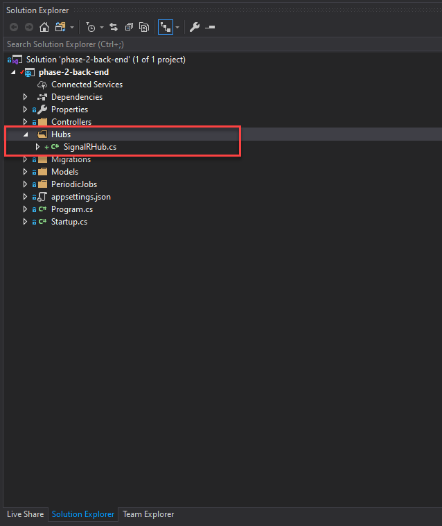

# Introduction

Welcome back! Hope you have enjoyed building this year pixel canvas project so far! 😀

In this section, we will be taking a look at implementing SignalR, an open-source library that adds a real-time functionality to your web app. 

Real-time web functinality enables server-side code to push content to connected-clients as it happens in real-time! 

<p align="center">
    
    
</p>


## But why do we need a real-time functionality? 

As you are aware with the current implementation although our app seems to be real-time, our front end React application relies API calls polling every 10 seconds to fetch for any changes on the canvas from the database. On top of this, updating any squares add extra calls to the back end to save changes to the database. 

This means that if you have 100 player connected to your app making a request every 10 seconds, at least 6000+ calls will be make in just 10 minutes! 

Furthermore, as each player simultaneously changes the canvas, none of them will actually see the changes happen until their 10 seconds window elapses. 

Not so real-time anymore... 😢

So, let's explore how we can make our canvas truly real-time, and reduce number of API calls to just two!

## SignalR

SignalR is perfect for apps that requires high frequency updates from the server. Here are some candidates

- gaming
- social networks
- voting
- auction
- map
- chat
- alerts, many other apps use notifications.

In this section, we will be implementing ASP.NET Core SignalR to our back end web api, which acts as a hub sending updates to each connected client (browser) as changes happened. 

We will also implements a JS/TypeScript SignalR client side library to our front-end which will listen for any updates from our back end and re-render our UI in real-time! 

Read more: [Real-time ASP.NET with SignalR](https://dotnet.microsoft.com/apps/aspnet/signalr)


<p align="center">
    
</p>

## Demo
Here you can see that updating a square on one canvas instantly updates other instances (right screen) of the canvas in real-time. 

<p align="center">
    
</p>

- [Try out the live demo here](https://signalr-frontend-prototype-msa2020.azurewebsites.net/)


# Setting up the SignalR back-end hub

We will be picking up from the previous completed pixel application. Check-out previous sections if you haven't done so.

In this section we will first setup the SignalR hub in our back end web api.  

## 1. Installing SignalR library

Head to Nuget package manager for your project and install `Microsoft.AspNetCore.SignalR.Core` package.

<p align="center">
    
</p>

## 2. Implementing SignalR hub class

1. Add a new folder `Hubs` and a new class `SignalRHub.cs`

<p align="center">
    
</p>

1. Inside the new `SignalRHub.cs` class, add `using Microsoft.AspNetCore.SignalR;` at the top and inherit from `Hub` class.

<p align="center">
    
</p>

2. Here we will implements our first `override` method `OnConnectedAsync()`, which is called when the new client (a browser) connection is established with our back-end.
    
    `string clientIp = Context.GetHttpContext().Connection.RemoteIpAddress.ToString();`

    - Here we get an IP address from the connection established.
    
    `await Clients.Others.SendAsync("NewUserConnected", clientIp);` 

    - Here, when a client connects to the server, signalr hub will invoke a method call `NewUserConnection` on all the other clients, and give them this new user IP address variable `clientIp` to notify them that a new player has joined!  

``` C#
using System;
using System.Collections.Generic;
using System.Linq;
using System.Threading.Tasks;
using Microsoft.AspNetCore.SignalR;

namespace phase_2_back_end.Hubs
{
    public class SignalRHub : Hub
    {
        public override async Task OnConnectedAsync()
        {
            string clientIp = Context.GetHttpContext().Connection.RemoteIpAddress.ToString();
            await Clients.Others.SendAsync("NewUserConnected", clientIp);

            await base.OnConnectedAsync();
        }
    }
}
```

In the next section we will implements a client code on our front-end to receive this IP address value from our hub.


## 3. Configuring SignalR dependency injection.

Before we switch to our React front-end side, headover to `Startup.cs` to add SignalR to the ASP.NET Core dependency injection and routing systems.

1. Under `public void ConfigureServices(IServiceCollection services)` add `services.AddSignalR()` dependency injection.

``` C#
// This method gets called by the runtime. Use this method to add services to the container.
public void ConfigureServices(IServiceCollection services)
{
    services.AddCors(options =>
    {
        options.AddPolicy(name: MyAllowSpecificOrigins,
                          builder =>
                          {
                              builder.WithOrigins("http://localhost:3000")
                                                    .AllowAnyHeader()
                                                    .AllowAnyMethod();
                          });
    });
    services.AddControllers();
    services.AddSwaggerGen(option =>
    {
        option.SwaggerDoc(name: "v1", new OpenApiInfo { Title = "My API", Version = "v1" });
    });
    services.AddDbContext<ApplicationDatabase>(options =>
        options.UseSqlServer(Configuration.GetConnectionString("sqlDatabase"))
    );

    //Hanfire 
    services.AddHangfire(config => config.UseMemoryStorage());
    services.AddHangfireServer();
    services.AddScoped<IPeriodicCanvasJobs, PeriodicCanvasJobs>();

    services.AddSignalR();
}
```
2. Next, under `public void Configure(IApplicationBuilder app, IWebHostEnvironment env)` method. 

- Replaces `app.UseCors(MyAllowSpecificOrigins);` with below configuration.

``` C#
app.UseCors(builder => {
    builder.WithOrigins("http://localhost:3000")
            .AllowAnyHeader()
            .AllowAnyMethod()
            .AllowCredentials();
});
```

Now this should look like the following.

``` C#
// This method gets called by the runtime. Use this method to configure the HTTP request pipeline.
public void Configure(IApplicationBuilder app, IWebHostEnvironment env, IPeriodicCanvasJobs periodicCanvasJobs)
{
    if (env.IsDevelopment())
    {
        app.UseDeveloperExceptionPage();
    }
    app.UseSwagger();

    app.UseSwaggerUI(x =>
    {
        x.SwaggerEndpoint("/swagger/v1/swagger.json", "My Api");
    });

    app.UseHangfireDashboard();
    RecurringJob.AddOrUpdate("some-id", () => periodicCanvasJobs.CreateNewCanvas(), "0 0 * * *", TimeZoneInfo.FindSystemTimeZoneById("New Zealand Standard Time"));

    app.UseRouting();

    app.UseCors(builder => {
        builder.WithOrigins("http://localhost:3000")
                .AllowAnyHeader()
                .AllowAnyMethod()
                .AllowCredentials();
    });

    app.UseAuthorization();

    app.UseEndpoints(endpoints =>
    {
        endpoints.MapControllers();
    });

}
```
- Make sure `app.UseCors()` is still between `app.UseRouting();` and `app.UseAuthorization();`

3. Inside `app.UseEndpoints()` add `endpoints.MapHub<SignalRHub>("/hub");` mapping. (`SignalR` class will need to be imported.)

```C#
app.UseEndpoints(endpoints =>
{
    endpoints.MapControllers();
    endpoints.MapHub<SignalRHub>("/hub");
});
```

- This mapping will be used by your front-end to establish the connection. The front-end will use `https://[back-end domain]/hub` endpoint for its requests.


# Implementing SignalR client code

## 1. Connecting front-end to the back-end hub.

Let's add SignalR to our front-end react application, so it can send and receives updates with our back-end in real-time. 🔥

1. Head to your front-end directory, add the SignalR client side package with `npm install @microsoft/signalr`. 
   - [`@microsoft/signalr` package information](https://www.npmjs.com/package/@microsoft/signalr)

2. Once complete, in `LatestGrid.tsx` component - import the following SignalR class.

    `import { HubConnectionBuilder, LogLevel, HubConnection } from "@microsoft/signalr";`

3. In the `LatestGrid` function component setup the following SignalR connection.

``` js
const LatestGrid = () => {
  const [colourArray, setColourArray] = useState<string[][]>([]);
  const [hubConnection, setHubConnection] = useState<HubConnection>();

  useEffect(() => {
    const createHubConnection = async () => {
      const connection = new HubConnectionBuilder()
        .withUrl("https://localhost:44301/hub")
        .configureLogging(LogLevel.Information)
        .withAutomaticReconnect()
        .build();
      try {
        await connection.start();
        console.log("Successfully connected to signalR hub.");
      } catch (error) {
        console.log(
          "Error establishing connection to signalR hub: " + { error }
        );
      }

      setHubConnection(connection);
    };
    createHubConnection();
  }, []);

...

```

- We declare a new hook `const [hubConnection, setHubConnection] = useState<HubConnection>();` for our SignalR connection object.

- Utilizing the `useEffect()` hook which will be called when the component is created. We created the signalR connection object with url pointing to our back-end hub ( signalR hub mapping we configured earlier `/hub`).
- We then start the connection with `await connection.start();`
- Finally we set our `hubConnection` state with the signalR connection object we created using `setHubConnection(connection);`.
- `createHubConnection();` is invoked to start the process.

Test your signalR implementation locally, `npm start` your front-end as well as your back-end server.

you should be able to see the message logged in Chrome Dev console `"Successfully connected to signalR hub."` (F12 Chrome).

<p align="center">
    
</p>

## 2. Responding to back-end request

1. Earlier we implemented one method in our back-end `SignalRHub.cs` class. `OnConnectedAsync()` which when a new client connection is established with the back-end, invokes `NewUserConnected` functions on every other clients. 

``` C#
public override async Task OnConnectedAsync()
{
    string clientIp = Context.GetHttpContext().Connection.RemoteIpAddress.ToString();
    await Clients.Others.SendAsync("NewUserConnected", clientIp);

    await base.OnConnectedAsync();
}
```
1. Let's add `NewUserConnected` event handler on the client-side that the server is calling. Use `connection.on({method name}, {parameters} => {});`. 

- Recall that this event handler is triggered by our back-end when a new connection is established, passing the connection IP address into our front-end.

``` js
  useEffect(() => {
    const createHubConnection = async () => {
      const connection = new HubConnectionBuilder()
        .withUrl("https://localhost:44301/hub")
        .configureLogging(LogLevel.Information)
        .withAutomaticReconnect()
        .build();
      try {

        connection.on("NewUserConnected", (clientIp: string) => {
          console.log("New user joined the session - IP: " + clientIp);
        });

        await connection.start();
        console.log("Successfully connected to signalR hub.");

      } catch (error) {
        console.log(
          "Error establishing connection to signalR hub: " + { error }
        );
      }

      setHubConnection(connection);
    };
    createHubConnection();
  }, []);

```

Go ahead and test whether this front-end client method is wired up correctly. When you open multiple browsers, all existing connected clients' will be notified by our back-end in real-time! 

Here we see `IP: ::1` because we are running locally.

<p align="center">
    
</p>

# Keeping the state of the canvas on our back-end SignalR hub.

Currently every client is continously calling the back-end API to fetch and update data from the database. With SinalR, the connection is kept-alive between the client and the back-end hub, so we can actually keep state of the canvas on our hub allowing any clients to dynamically change it in real-time!

This means that we only needs to make a `GetCanvas()` call only once when the first player joins to initialize the state of the canvas. We also only need one update call to the back-end when the last player leaves to stored the final state of the canvas.

## 1. Initialize the state of the canvas

1. In our `SignalRHub.cs` let's bring in a `CanvasController` through our `SignalRHub` constructor. 

- Add the following contructor to our `SignalRHub.cs` class. (You will need to import all the neccesary namespaces as shown by the warnings.)

``` C#
    public class SignalRHub : Hub
    {
        private CanvasController _canvasController;

        public SignalRHub(ApplicationDatabase context, IConfiguration config)
        {
            _canvasController = new CanvasController(context, config);
        }

    ...
```

Through dependency injection, we can bring in database `context`, and `config` needed to instantiate a `CanvasController` class. This gives us access to all the methods which we will need in order to call `GetCanvas()` and retrievs the latest canvas from the databases.

2. Let's create a static `CurrentSession` class that will hold the real-time ColourArray and keep tracks of connected users.

- Add the following class next to your `SignalRHub` class

``` C#
    public static class CurrentSession
    {
        public static string[][] ColourArray;
        public static HashSet<string> ConnectedIds = new HashSet<string>();
    }
```

3. To keep track of all connection instances add the following to our `OnConnectedAsync()` method.

- `CurrentSession.ConnectedIds.Add(Context.ConnectionId);`

``` C#
public override async Task OnConnectedAsync()
{
    string clientIp = Context.GetHttpContext().Connection.RemoteIpAddress.ToString();
    await Clients.Others.SendAsync("NewUserConnected", clientIp);
    
    CurrentSession.ConnectedIds.Add(Context.ConnectionId);

    await base.OnConnectedAsync();
}
```
This adds the connection ID to our `CurrentSession.ConnectedIds` HashSet, so that we know when the last player disconnect.

4. Here, we check if the `CurrentSession.ColourArray` is empty, if so we initialized the canvas by calling `_canvasController.GetCanvas()`. We need to deserialize this into an object since the method returns JSON string.

5. However, for subsequent new connections we can simply return the `CurrentSession.ColourArray` that we already have on the hub. 

- Here we use `Clients.Caller.SendAsync()` to only invoke this handler on the new client connecting, rather than everyone.
``` C#
public override async Task OnConnectedAsync()
{
    string clientIp = Context.GetHttpContext().Connection.RemoteIpAddress.ToString();
    await Clients.Others.SendAsync("NewUserConnected", clientIp);
    CurrentSession.ConnectedIds.Add(Context.ConnectionId)

    if (CurrentSession.ColourArray == null)
    {
        CurrentSession.ColourArray = JsonConvert.DeserializeObject<string[][]>(_canvasController.GetCanvas());
        await Clients.Caller.SendAsync("ColourArrayUpdated", CurrentSession.ColourArray);
    }
    else
    {
        await Clients.Caller.SendAsync("ColourArrayUpdated", CurrentSession.ColourArray);
    }

    await base.OnConnectedAsync();
}
```
## 2. Responding to canvas changes in real-time

Let's implement a client-side event handler for `ColourArrayUpdated`.


1. Back in `LatestGrid.tsx`, add a new event handler `ColourArrayUpdated`, which receives the colorArray from the back-end on it being updated. 

``` JS
  useEffect(() => {
    const createHubConnection = async () => {
      const connection = new HubConnectionBuilder()
        .withUrl("https://localhost:44301/hub")
        .configureLogging(LogLevel.Information)
        .withAutomaticReconnect()
        .build();
      try {

        connection.on("NewUserConnected", (clientIp: string) => {
          console.log("New user joined the session - IP: " + clientIp);
        });

        connection.on("ColourArrayUpdated", (colorArray: string[][]) => {
          setColourArray(colorArray);
        });

        await connection.start();
        console.log("Successfully connected to signalR hub.");

      } catch (error) {
        console.log(
          "Error establishing connection to signalR hub: " + { error }
        );
      }

      setHubConnection(connection);
    };
    createHubConnection();
  }, []);

```

2. Removes the entire `useEffect()` polling api calls here as we soon won't need polling to simulate real-time changes.

``` js
  useEffect(() => {
    const makeArrayRequest = async () => {
      setColourArray(await getArray());
    };
    makeArrayRequest();
    setInterval(makeArrayRequest, 10000);
  }, []);
```
3. Test your changes, in the network tab (Chrome F12) you should no longer see `GET` request being made in order to retrieves the canvas.

## Updating the state of the canvas on our back-end hub

We are still directly making `UpdateCell [put]` request to update our database when any pixel grid changes. We want to instead just update the  `CurrentSession.ColourArray` in our back-end hub, so it can broadcast the new canvas changes in real-time.

4. In `LatestGrid.tsx` remove & change the `modifyColour` method to the following.

``` js
  const modifyColour = async (props: ModifyProps) => {
    hubConnection?.invoke("UpdateColourArray", JSON.stringify(props)).catch(err => console.error(err));
  };
```
- Here we use `hubConnection` state and invoke our back-end hub method call `UpdateColourArray` and pass in the JSON string of the updated cell information. 

interface `ModifyProps` is made up of the following properties.

``` JS
export interface ModifyProps {
  position: { row: number; col: number };
  colour: string;
}
```

5. In our `SignalRHub.cs`, create two new classes next to `CurrentSession`. This will deal with deserializing the JSON recevied from the client into a `CellUpdate` object.

``` C#
    public class CellUpdate
    {
        public Position Position { get; set; }
        public string Colour { get; set; }
    }

    public class Position
    {
        public int Row { get; set; }
        public int Col { get; set; }
    }

```

6. Add `UpdateColourArray` method inside `SignalRHub` class (which is invoked when the front-end is modified earlier). 

- This method simply deserialized the JSON into a `cellUpdate` object, which then used to update the correct corresponding cell in `CurrentSession.ColourArray` object using Row and Col properties indexes.
- We then calls `await Clients.All.SendAsync("ColourArrayUpdated", CurrentSession.ColourArray);` to update every connected clients with the new canvas.

``` C#
public async Task UpdateColourArray(string cellUpdateJson)
{
    CellUpdate cellUpdate = JsonConvert.DeserializeObject<CellUpdate>(cellUpdateJson);
    CurrentSession.ColourArray[cellUpdate.Position.Row][cellUpdate.Position.Col] = cellUpdate.Colour;
    await Clients.All.SendAsync("ColourArrayUpdated", CurrentSession.ColourArray);
}
```

Test your application, open multiple instances and try modify the canvas. You should see all the changes happening in real-time!

# Saving the canvas to the database

While we have successfully make modifying the canvas happens in real-time. We haven't been saving the changes back to our database, which means if the server is powered down then all the changes are lost.

Let's implement a mechanism to update the database with the new canvas once the last player leaves the game.

# Implementing UpdateCanvas()

We will implements `UpdateCanvas` PUT method in our `CanvasController.cs`, which takes an `string[][] updatedCanvas` string array from our `CurrentSession.ColourArray` and update it to the database.

1. Inside `CanvasController.cs` add the following PUT methods.

```C#
[HttpPut]
[Route("UpdateCanvas")]
public async Task<IActionResult> UpdateCanvas(string[][] updatedCanvas)
{
    var canvas = _context.Canvas
        .Include(c => c.ColorData)
        .OrderByDescending(c => c.CanvasID)
        .FirstOrDefault()

    canvas.ColorData.ToList().ForEach(cell =>
    {
        var updatedCanvasHex = updatedCanvas[cell.RowIndex][cell.ColumnIndex];
        if (cell.Hex != updatedCanvasHex) {
            cell.Hex = updatedCanvasHex;
        }
    });
    await _context.SaveChangesAsync();
    return NoContent();
}
```

- Here we retrieves the latest `canvas` object from the database along with its ColorData. 
- We then convert `canvas.ColorData` to a list and for each cell color data, we compare it against our `CurrentSession.ColourArray` from SignalR hub. If the original hex colour value is different, we updated it with the new one that has been changed.
- We then `await _context.SaveChangesAsync();` to save the database changes.

2. Back in `SignalRHub.cs`, add the following override method.

``` C#
public override async Task OnDisconnectedAsync(Exception ex)
{
    CurrentSession.ConnectedIds.Remove(Context.ConnectionId);
    if (CurrentSession.ConnectedIds.Count == 0)
    {
        await _canvasController.UpdateCanvas(CurrentSession.ColourArray);
    }
    await base.OnDisconnectedAsync(ex);
}
```
- `OnDisconnectedAsync` is invoked when any connected users disconnect (e.g. close the browser). 

Here we remove thier connection id from our HashSet and check if the last player has left (i.e. `Count == 0`), we call `UpdateCanvas()` PUT method implemented earlier on `_canvasController` and pass in `CurrentSession.ColourArray` making sure the latest state of the canvas is saved back into the database.

# Conclusion

And that concludes implementing real-time functionality with SignalR. 

Hope you guys have enjoyed this tutorial and learnt a lot. 👍

Best wishes for the week ahead! 🎉


